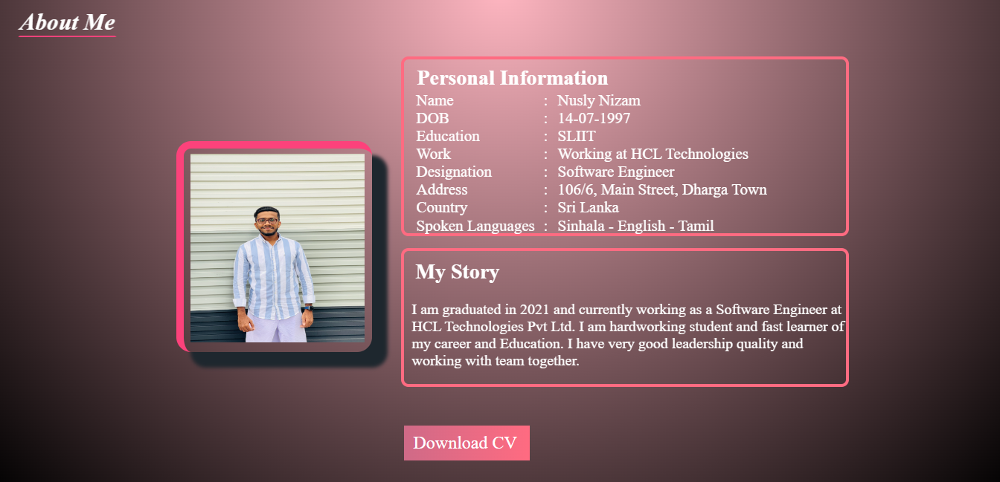
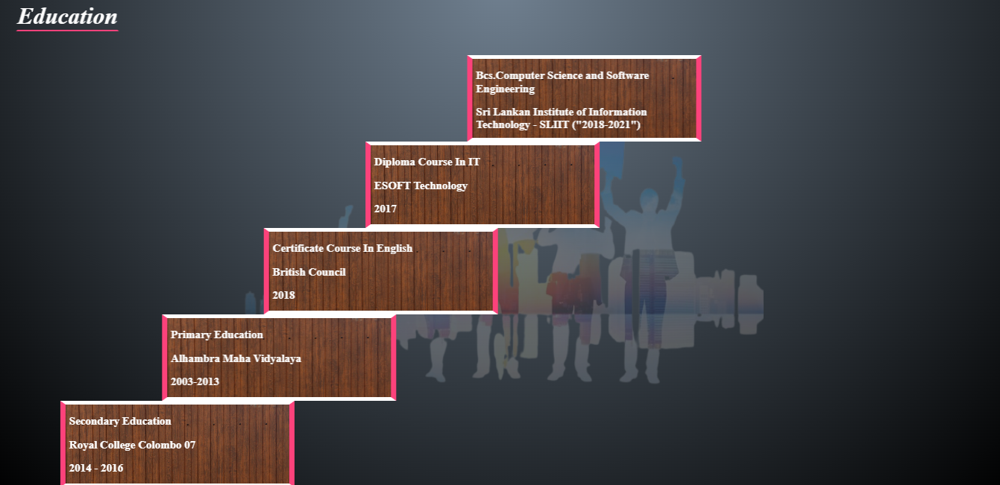
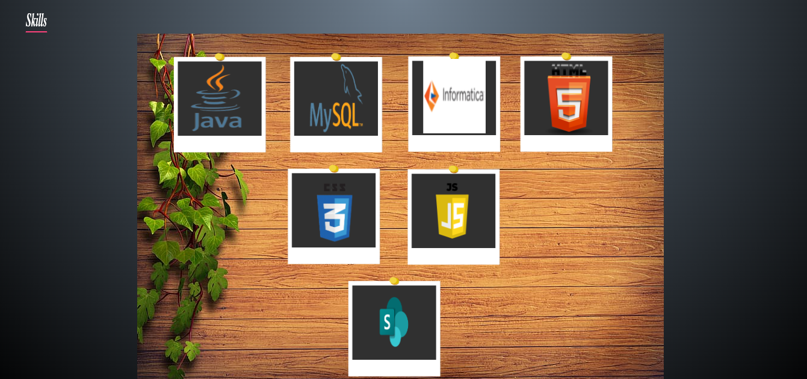
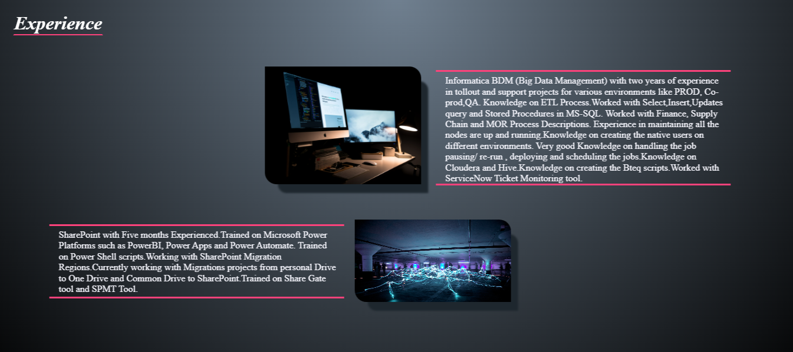
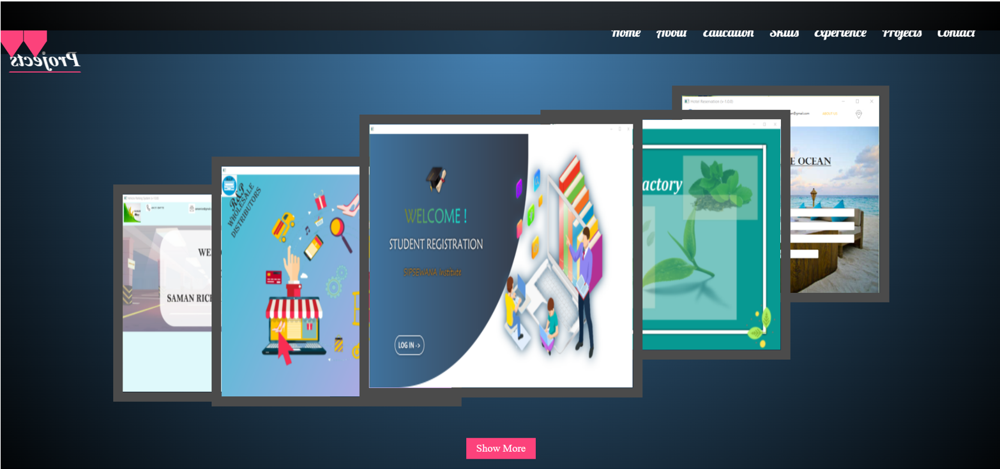
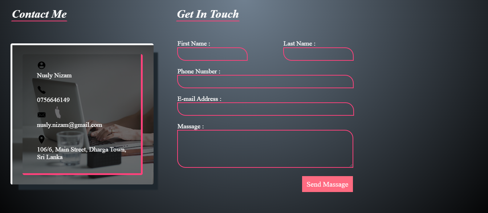
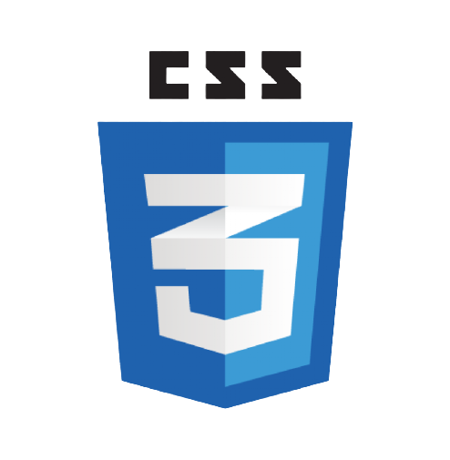
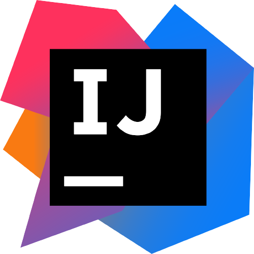
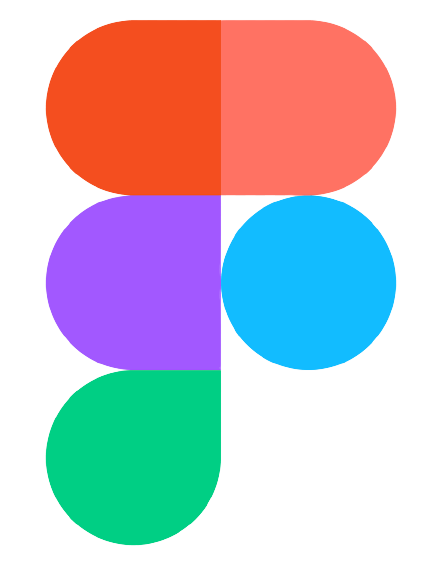

# *About* ❓

This is my **Personal Profile**.

I'm Nusly Nizam and I am passionate software engineer based in Sri Lanka.
This is a professional documentation that provides proof of my accomplishments of my work.

# *Importance* 📝

This is a great way to demonstrate my competencies. During a job Search, this profile showcase my work to the potential employers.
It presents evidence of my relevant skills and abilities.

# *Details* 🔖

Below you can see the languages , tools I used and some links of my Profile.

## Images 📷

## Languages 📗

   

## Tools 📌

## Links 🔎

* **SiteMap URL-** https://www.gloomaps.com/Jc9afdjkC6

* **Wireframe URL-** https://wireframe.cc/1Wnk7i

* **Mockup URL-** https://www.figma.com/file/sC3QVYd1k8yUdJRAru7VsM/Untitled?node-id=15%3A50

* **Github Pages URL for MyProfile-** https://github.com/nuzynuz/MyProfile

* **GitHub Link-** https://github.com/nuzynuz

